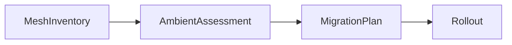

# Ambientor — architecture progress tracker

Use this file to see **what is done**, **what is in progress**, and **what to do next**.  
Agents should update status when a step is started, merged, or blocked.

**Legend:** ✅ done · 🔄 in progress · ⬜ pending · ⏸ blocked

**Current focus:** Phase 3, Step 3.4 — audit log (`cursor/rollout-audit-log`).

**Next up:** kind e2e bookinfo → plan → rollout → verify (3.5).

**Last updated:** 2026-05-23

---

## Designed flow (reference)

See [architecture/README.md](architecture/README.md) and [ADR 001](adr/001-in-cluster-deployment.md).

---

## Phase 0 — Foundation

| Step | Task | Status | Branch / PR | Notes |
|------|------|--------|-------------|-------|
| 0.1 | Rust 1.95 workspace, 14 crates, CRDs | ✅ | PR [#1](https://github.com/arencloud/ambientor/pull/1) | Merged |
| 0.2 | Helm chart, RBAC, operator + API + web | ✅ | PR #1 | Postgres optional via `DATABASE_URL` |
| 0.3 | CI: fmt, clippy, test, cargo-deny | ✅ | PR #1 | |
| 0.4 | Git rules (no Cursor co-author / PR footer) | ✅ | `.cursor/rules/git-commits.mdc` | |

---

## Phase 1 — Read path (trustworthy assessment)

| Step | Task | Status | Branch / PR | Notes |
|------|------|--------|-------------|-------|
| 1.1 | **Lab validation runbook** | ✅ | `docs/runbook-lab.md`, `docs/lab/*`, `scripts/lab-*` | Step 1 deliverable; you run on kind/lab |
| 1.2 | Real mesh inventory (Istio/Gateway API CRDs) | ✅ | PR [#2](https://github.com/arencloud/ambientor/pull/2) | `PolicyContext`, istiod version |
| 1.3 | Assessment evidence + sidecar/DR rules | ✅ | PR [#3](https://github.com/arencloud/ambientor/pull/3) | `Finding.evidence`, workload scan |
| 1.4 | Operator informers (replace 30s polling) | ✅ | PR [#5](https://github.com/arencloud/ambientor/pull/5) | kube-runtime watches; stable `{name}-assessment`; `observedGeneration` |
| 1.5 | Deeper rules (SPIRE, EF-on-waypoint, version gates) | ✅ | PR [#6](https://github.com/arencloud/ambientor/pull/6) | `PlatformContext`, Istio 1.24+ gate |
| 1.6 | OSSM namespace / MemberRoll inventory | ✅ | Part of 1.5 | MemberRoll list + enrollment warning |
| 1.7 | Portal assessment UI + evidence | ✅ | PR [#7](https://github.com/arencloud/ambientor/pull/7) | Merged |
| 1.8 | SARIF export (`ambientor assess --output sarif`) | ✅ | PR [#8](https://github.com/arencloud/ambientor/pull/8) | Merged |
| 1.9 | Persist scans in Postgres | ✅ | PR [#9](https://github.com/arencloud/ambientor/pull/9) | Merged; `GET /api/v1/scans` |

**Phase 1 exit criteria:** ✅ Assessment matches Istio migrate docs on real clusters; portal or SARIF shows evidence; operator uses watches.

---

## Phase 2 — Plan path

| Step | Task | Status | Branch / PR | Notes |
|------|------|--------|-------------|-------|
| 2.1 | `MigrationPlan` controller (assessment → plan CR) | ✅ | PR [#10](https://github.com/arencloud/ambientor/pull/10) | Merged |
| 2.2 | `PolicyTranslation` (VS → HTTPRoute suggestions) | ✅ | PR [#11](https://github.com/arencloud/ambientor/pull/11) | Merged |
| 2.3 | Portal plan review + manifest export | ✅ | PR [#12](https://github.com/arencloud/ambientor/pull/12) | Merged |
| 2.4 | CLI `plan create` + GitOps export | ✅ | PR [#13](https://github.com/arencloud/ambientor/pull/13) | Merged |

**Phase 2 exit criteria:** ✅ Human-approved plan with exported YAML/JSON; no rollout required (portal + CLI export).

---

## Phase 3 — Rollout path (approval-gated)

| Step | Task | Status | Branch / PR | Notes |
|------|------|--------|-------------|-------|
| 3.1 | Real `DeployWaypoint` / `TranslatePolicy` / restart / verify | ✅ | PR [#15](https://github.com/arencloud/ambientor/pull/15) | Merged |
| 3.2 | Rollback reverts labels/manifests | ✅ | PR [#16](https://github.com/arencloud/ambientor/pull/16) | Merged |
| 3.3 | Approval API + portal UI | ✅ | PR [#17](https://github.com/arencloud/ambientor/pull/17) | Merged |
| 3.4 | Audit log for approve/apply/rollback | 🔄 | `cursor/rollout-audit-log` | PR pending |
| 3.5 | kind e2e: bookinfo → plan → rollout → verify | ⬜ | `cursor/e2e-kind-ambient` | CI job |

**Phase 3 exit criteria:** One namespace at a time; verify + auto-rollback proven in e2e.

---

## Phase 4 — Enterprise

| Step | Task | Status | Branch / PR | Notes |
|------|------|--------|-------------|-------|
| 4.1 | Full OIDC (discovery + callback) | ⬜ | `cursor/oidc-auth` | URL builder only today |
| 4.2 | Namespace-scoped Casbin in Postgres | ⬜ | `cursor/rbac-postgres` | |
| 4.3 | Hub `ClusterConnection` remote clients | ⬜ | `cursor/hub-aggregation` | Secret existence check only |
| 4.4 | OpenShift OLM / SCC / MemberRoll wizard | ⬜ | `cursor/openshift-olm` | |

---

## Phase 5 — Ecosystem

| Step | Task | Status | Notes |
|------|------|--------|-------|
| 5.1 | Publish GHCR images (multi-arch) | ⬜ | Chart points at `ghcr.io/arencloud/ambientor` |
| 5.2 | kind/OpenShift in CI | ⬜ | |
| 5.3 | Performance (10k pods / informer cache) | ⬜ | |
| 5.4 | Pluggable DB trait | ⬜ | Optional |
| 5.5 | Logo variants for UI | ⬜ | `docs/images/logo/` |

---

## Production pilot checklist

| # | Criterion | Status |
|---|-----------|--------|
| P1 | Blockers match Istio migrate docs on 3+ clusters | ⬜ |
| P2 | Plans human-approved with exported manifests | ⬜ |
| P3 | Rollout: one NS, verify + auto-rollback in e2e | ⬜ |
| P4 | Portal/OIDC gates approve + execute | ⬜ |
| P5 | Audit log for approve / apply / rollback | ⬜ |

---

## How to update this file

1. When starting work: set step to 🔄 and add branch name.
2. When PR merges: set ✅, add PR link, set **Next up** at top.
3. When blocked: set ⏸ and add one-line reason under Notes.

Roadmap detail per feature: `docs/roadmap/*.md`.
